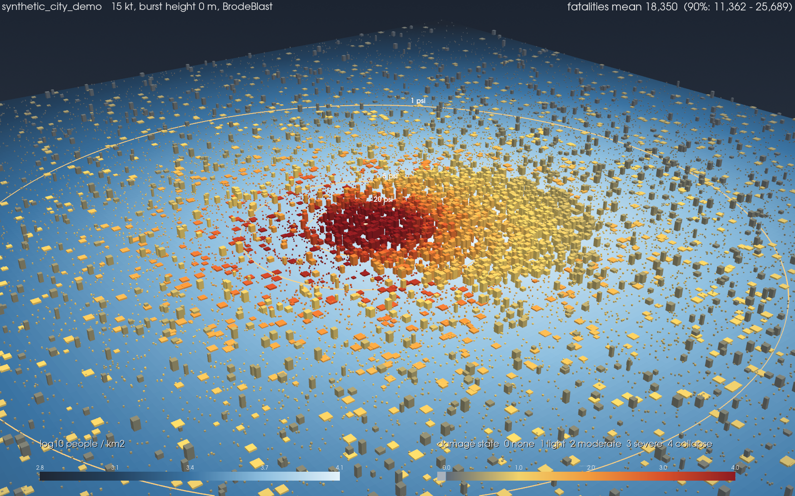

# effects-sim

Hazard and consequence modelling toolkit built on published open-literature models.
Source models feed vulnerability models, with Monte Carlo uncertainty on top, rendered in 2D and
3D. A 2D compressible solver comes in Build 3.

**Status:** Build 1 (analytic engine) and Build 2 (3D rendering) complete. Read `docs/DESIGN.md`
for the validation status and known limitations before trusting any number. Fragility defaults are
mostly placeholders (only the residential collapse medians are anchored) and casualty defaults are
placeholders.



## Setup (Windows 11, VS Code)

```powershell
py -3.11 -m venv .venv
.venv\Scripts\Activate.ps1
pip install -e ".[dev,viz]"
pytest
```

Then in VS Code: open the folder, pick the `.venv` interpreter, accept the recommended extensions.

## Usage

Quick radii calculator:

```powershell
effects calc --yield-kt 15
effects calc --yield-kt 15 --plot outputs/curves.png
```

Full scenario (synthetic city, works offline):

```powershell
effects run scenarios/synthetic_city.yaml
effects run scenarios/synthetic_city.yaml --samples 50   # quick look
```

Outputs land in `outputs/<name>/`: `summary.json`, `buildings.csv` (per-building state
probabilities), `fields.npz` (grids for Build 2) and five PNGs.

3D view of a finished run (Build 2):

```powershell
effects view outputs/synthetic_city_demo                       # interactive window + time slider
effects view outputs/synthetic_city_demo --layer fatalities --screenshot outputs/3d.png
effects view outputs/synthetic_city_demo --animate outputs/shock.gif
effects view outputs/synthetic_city_demo --animate outputs/shock.mp4 --frames 120
effects view outputs/synthetic_city_demo --export-vtk outputs/vtk   # open in ParaView
```

Layers: `population` (default), `fatalities`, `overpressure`, `fluence`. `--z-scale` sets building
height exaggeration (default 1.5).

Air bursts: `scenarios/synthetic_city_airburst.yaml`. The default `brode` blast model includes
height-of-burst (Mach-stem) effects.

Real places: `pip install -e ".[geo]"`, download a WorldPop or GHSL population GeoTIFF into
`cache/`, then edit `scenarios/real_area_template.yaml`. OSM buildings are fetched once and cached.

## Making it quantitative

1. Replace `src/effects/fragility/default_fragility.yaml` (or point `environment.fragility_library`
   at your own file) with referenced values. Each class has a `basis` tag (`anchored` or
   `placeholder`) and a `reference` note; keep them honest.
2. Blast validation already runs against Brode, the DNA free-air standard and a Glasstone
   height-of-burst point (`pytest -m validation`). You can add transcribed Glasstone figure
   values to `tests/validation/data/reference_points.csv`.

## Layout

```
src/effects/
  sources/      blast (Brode HOB fit, Kinney-Graham), thermal, shock arrival
  fragility/    building curves (YAML), casualty model
  data/         grid, synthetic city, real-world loaders (cached in cache/)
  montecarlo/   uncertainty engine
  viz/          2D plots, 3D scene (PyVista)
  scenario.py   YAML schema
  cli.py        `effects calc` / `effects run` / `effects view`
tests/
  unit/         fast function-level tests
  validation/   closed-form Monte Carlo checks, published-table harness
scenarios/      YAML scenario files
docs/           design notes
```

## Licence

MIT. See `LICENSE`.

## Credits

Brode (1986) and DNA free-air constants transcribed from the MIT-licensed
[glasstone](https://github.com/GOFAI/glasstone) library.
